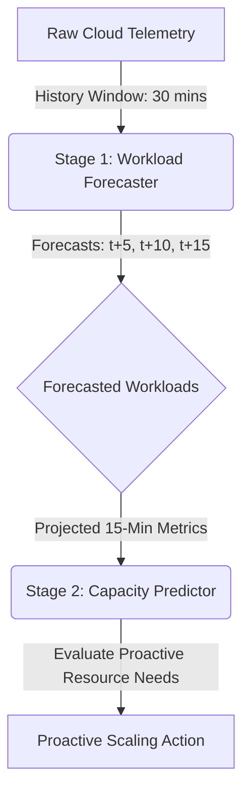

# AI-Powered Predictive Cloud Resource Optimization & Auto-Scaling System

A comprehensive, production-quality machine learning system implementing a two-stage **Predictive Autoscaling** architecture. It transitions scaling decisions from a *reactive* model (adjusting to current load) to a *proactive* model (forecasting workload trends and scaling in advance to prevent service disruptions).

---

## 📂 Project Directory Structure

```text
ai-cloud-resource/
│
├── data/                    # Raw & preprocessed datasets, and plots
│   ├── synthetic_workload.csv   # Raw workload metrics (5-min intervals)
│   ├── cleaned_workload.csv     # Preprocessed, validated, and anomaly-cleaned dataset
│   └── plots/               # Automatically generated dashboard & forecasting visualizations
│
├── src/                     # Reusable source code modules
│   ├── __init__.py          # Python package initializer
│   ├── generator.py         # Workload metrics generator (5-min intervals)
│   ├── validation.py        # Static schema and data boundary validation
│   ├── pipeline.py          # Preprocessing, duplicate removal, NaN handling, and scaling
│   ├── features.py          # Lag, rolling, trend, and cyclical temporal feature engineering
│   ├── forecasting.py       # Time-series workload forecasting engine (Stage 1)
│   └── train_models.py      # Stage 2 capacity predictor training & MDI report
│
├── artifacts/               # Serialized binary machine learning assets
│   ├── forecaster_5min.pkl                      # 5-min workload forecaster (XGBoost)
│   ├── forecaster_10min.pkl                     # 10-min workload forecaster (XGBoost)
│   ├── forecaster_15min.pkl                     # 15-min workload forecaster (XGBoost)
│   ├── cloud_resource_optimization_model.pkl   # Server capacity predictor (Random Forest)
│   ├── scaler.pkl                               # StandardScaler fitted on clean features
│   ├── features_list.pkl                        # Feature column names for Capacity model
│   └── forecasting_features_list.pkl            # Feature column names for Forecaster models
│
├── main.py                  # FastAPI Backend serving predictive scaling queries
├── test_main.py             # Unit tests checking API endpoints
├── test_pipeline.py         # Unit tests checking preprocessing pipelines
├── test_forecasting.py      # Unit tests checking workload forecasting pipeline
├── requirements.txt         # Project package dependencies
├── Dockerfile               # Containerization configuration
└── README.md                # Project documentation & instructions
```

---

## 🛠️ Tech Stack & Requirements
* **Framework:** FastAPI, Uvicorn (REST API Backend)
* **ML Engines:** Scikit-Learn, XGBoost, Pandas, NumPy, Joblib
* **Visualizations:** Matplotlib
* **Unit Testing:** Pytest, HTTPX

---

## 🚀 Two-Stage Predictive Auto-Scaling Architecture

This project divides predictive scaling into a modular two-stage execution:



1. **Stage 1 (Workload Forecaster):** Fits an `XGBoost` regressor to forecast core metrics (`cpu_usage`, `memory_usage`, `network_traffic`, `active_users`, `request_rate`, `response_time`) for the next 5, 10, and 15 minutes. It uses direct multi-step forecasting to prevent multi-step error accumulation.
2. **Stage 2 (Capacity Predictor):** Fits a `RandomForestRegressor` capacity model to map resource metrics to `required_servers`. Feeding the forecasted 15-minute workloads into this capacity model determines optimal server counts 15 minutes in advance, allowing Auto-Scaling groups to boot VMs before traffic spikes peg existing instances.

---

## 🏃 Step-by-Step Execution Guide

### 1. Installation
Install all package dependencies:
```bash
pip install -r requirements.txt
```

### 2. Generate Workload Metrics (5-Min Interval)
Generate a 30-day synthetic telemetry dataset containing diurnal patterns, weekend variance, and resource anomalies:
```bash
python -m src.generator
```
* Saves raw data to `data/synthetic_workload.csv` (8,643 rows).

### 3. Run Preprocessing Pipeline
Deduplicate, impute NaNs, clip outliers, generate base features, and fit standardizers:
```bash
python -m src.pipeline
```
* Saves cleaned data to `data/cleaned_workload.csv` and standardizer to `artifacts/scaler.pkl`.

### 4. Train Workload Forecasters (Stage 1)
Fit, compare, and serialize the multi-horizon forecasting models:
```bash
python -m src.forecasting
```
* Compares Random Forest, XGBoost, and Gradient Boosting.
* Saves forecaster models to `artifacts/forecaster_5min.pkl`, `artifacts/forecaster_10min.pkl`, and `artifacts/forecaster_15min.pkl`.
* Saves evaluation plots (`forecast_actual_vs_predicted.png`, `forecast_horizon_progression.png`, and `forecast_prediction_errors.png`) in `data/plots/`.

### 5. Train Capacity Predictor (Stage 2)
Fit and serialize the server capacity model:
```bash
python -m src.train_models
```
* Saves capacity model to `artifacts/cloud_resource_optimization_model.pkl` and outputs feature MDI analysis.

### 6. Run the Test Suite
Run automated unit tests to verify the pipeline, validation, forecasting, and API endpoints:
```bash
python -m pytest
```

### 7. Launch the API Server
Start the FastAPI REST backend to serve predictive scaling:
```bash
uvicorn main:app --reload
```
* Swagger UI Docs: `http://127.0.0.1:8000/docs`

---

## 📖 API Usage Example

Query the `/predict` POST endpoint with the current infrastructure telemetry:
* **Endpoint:** `POST http://127.0.0.1:8000/predict`
* **Request Payload:**
  ```json
  {
    "cpu_usage": 68.0,
    "memory_usage": 72.0,
    "network_in": 100.0,
    "network_out": 250.0,
    "network_traffic": 350.0,
    "disk_read": 80.0,
    "disk_write": 40.0,
    "active_users": 250,
    "request_rate": 625.0,
    "response_time": 185.0,
    "error_rate": 0.05,
    "current_servers": 5,
    "server_cost": 0.60
  }
  ```
* **Response Payload:**
  ```json
  {
    "current_cpu": 68.0,
    "predicted_cpu_5min": 76.5,
    "predicted_cpu_10min": 84.1,
    "predicted_cpu_15min": 91.2,
    "current_servers": 5,
    "predicted_required_servers": 8,
    "scaling_action": "SCALE UP",
    "reasoning": "Workload forecasting detects incoming spike. Predicted CPU: 91.2% in 15 mins. Proactive Recommendation: SCALE UP BEFORE WORKLOAD SPIKE.",
    "forecasts": {
      "5min": { "cpu_usage": 76.5, "memory_usage": 74.2, "network_traffic": 395.0, "active_users": 298.5, "request_rate": 745.2, "response_time": 210.5 },
      "10min": { "cpu_usage": 84.1, "memory_usage": 78.4, "network_traffic": 445.0, "active_users": 348.1, "request_rate": 870.5, "response_time": 245.1 },
      "15min": { "cpu_usage": 91.2, "memory_usage": 83.2, "network_traffic": 498.5, "active_users": 398.9, "request_rate": 998.2, "response_time": 290.4 }
    }
  }
  ```
