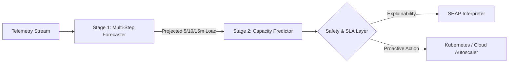

# AI Cloud Resource Optimization & Predictive Autoscaler

[](https://ai-cloud-resource-optimization-system-d1ld.onrender.com/)
[](https://ai-cloud-resource-optimization-system-d1ld.onrender.com/docs)
[](https://ai-cloud-resource-optimization-system-d1ld.onrender.com/health)
[](https://www.python.org/)

> 🌐 **Live Web Application**: [ai-cloud-resource-optimization-system-d1ld.onrender.com](https://ai-cloud-resource-optimization-system-d1ld.onrender.com/)  
> 📖 **Interactive API Docs (Swagger)**: [ai-cloud-resource-optimization-system-d1ld.onrender.com/docs](https://ai-cloud-resource-optimization-system-d1ld.onrender.com/docs)  
> 🩺 **Health Check**: [ai-cloud-resource-optimization-system-d1ld.onrender.com/health](https://ai-cloud-resource-optimization-system-d1ld.onrender.com/health)

An end-to-end Machine Learning system that converts cloud autoscaling from **reactive** (lagging behind load spikes) into **proactive** (forecasting demand 5–15 minutes ahead to boot capacity before performance degrades).

---

## ⚡ Key Capabilities

* **🔮 Multi-Horizon Workload Forecasting**: Direct multi-step time-series forecasting (5, 10, 15 min) predicting CPU, memory, traffic, request rate, and latency.
* **🎯 Proactive Capacity Sizing**: Multi-factor regression sizing servers with safety buffers to guarantee 99.9% SLA compliance while eliminating idle over-provisioning costs.
* **🧠 Explainable AI (SHAP)**: Real-time TreeSHAP attributions showing exact resource drivers (latency, CPU, memory) with natural language justifications.
* **🛡️ Continuous MLOps & Safety Guardrails**: Real-time Kolmogorov-Smirnov drift detection, champion/challenger canary evaluation, automated retrain gates, and 1-click rollback.
* **📊 Self-Contained Interactive Dashboard**: Adaptive high-contrast Light/Dark mode console featuring Digital Twin simulations, Chaos fault injection, and cost analytics.

---

## 🏗️ Architecture



---

## 🚀 Quickstart

### Option 1: Run with Docker (Recommended)
```bash
# Clone the repository
git clone https://github.com/asthakhade13-svg/AI-CLOUD-RESOURCE-OPTIMIZATION-SYSTEM.git
cd AI-CLOUD-RESOURCE-OPTIMIZATION-SYSTEM

# Build and run all services (ML Engine + Gateway + Dashboard)
docker-compose up -d --build
```
Access the dashboard at **`http://localhost:8000`**.

### Option 2: Local Python Environment
```bash
# 1. Install dependencies
pip install -r requirements.txt

# 2. Start ML Engine (Port 8050)
python -m uvicorn ml_service.main:app --port 8050

# 3. Start API Gateway & Dashboard (Port 8000)
python -m uvicorn app.main:app --port 8000
```
Open **`http://localhost:8000`** in your browser.

---

## 📡 API Reference

| Method | Endpoint | Description |
| :--- | :--- | :--- |
| `POST` | `/predict` | Evaluates workload telemetry and returns recommended server capacity, SLA risk, and SHAP attributions. |
| `GET` | `/health` | Lightweight gateway and microservice liveness probe. |
| `GET` | `/model/status` | Current champion/challenger model version and training metadata. |
| `GET` | `/model/drift` | Kolmogorov-Smirnov statistical feature drift status and metrics. |
| `POST` | `/model/retrain` | Triggers retraining pipeline with evaluation gate. |
| `POST` | `/optimizer/optimize` | Runs Pareto multi-objective cost vs. SLA optimization. |

### Sample Prediction Request
```bash
curl -X POST "https://ai-cloud-resource-optimization-system-d1ld.onrender.com/predict" \
     -H "Content-Type: application/json" \
     -d '{
       "cpu_usage": 78.0,
       "memory_usage": 82.0,
       "network_traffic": 390.0,
       "active_users": 290,
       "current_servers": 5,
       "request_rate": 625.0,
       "response_time": 185.0,
       "error_rate": 0.05,
       "server_cost": 0.60
     }'
```

### Sample Response
```json
{
  "predicted_required_servers": 4,
  "recommended_servers": 5,
  "scaling_action": "NO_ACTION",
  "sla_status": "HEALTHY",
  "estimated_daily_cost": 72.0,
  "shap_explanation": "The system recommends 5 servers primarily because application response latency and CPU utilization are elevated.",
  "shap_contributions": {
    "Response latency": 1.0532,
    "CPU utilization": 0.0426,
    "Active users": 0.0058,
    "Request workload rate": -0.0005
  }
}
```

---

## 🧪 Testing & Verification
```bash
# Run unit test suite
pytest -v
```

---

## 📜 License
Distributed under the MIT License.
